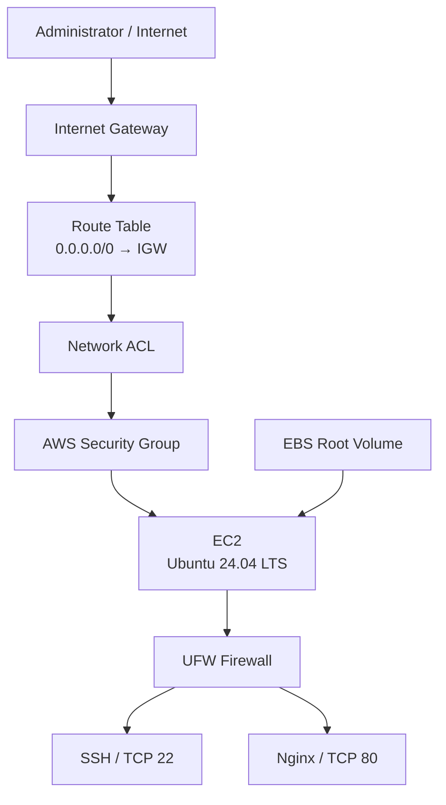

# Hardened Linux Web Server on AWS

> Deploying, securing, troubleshooting, and recovering an Ubuntu web server using AWS EC2, VPC networking, UFW, SSH, EBS, and Nginx.

##  Project Overview

This project demonstrates the deployment and security hardening of an Ubuntu Linux web server on Amazon Web Services (AWS).

The project evolved into a real troubleshooting and recovery exercise when SSH access failed. The failure was traced through the AWS networking layers and ultimately identified as a host-level UFW firewall rule allowing SSH from an outdated public IP address.

The server was recovered by attaching its root EBS volume to a temporary recovery instance, correcting the UFW configuration offline, reattaching the volume, and restoring SSH access.

---

##  Objectives

- Deploy an Ubuntu Linux server on AWS EC2.
- Understand the path of traffic through an AWS VPC.
- Configure layered network security.
- Restrict SSH access using AWS Security Groups and UFW.
- Disable password-based SSH authentication.
- Disable root SSH login.
- Deploy Nginx as a web server.
- Troubleshoot an SSH connection timeout systematically.
- Recover an inaccessible EC2 instance using its EBS root volume.
- Verify the final server configuration.
- Document the incident and recovery process.

---

##  Architecture



### Traffic flow

```text
Internet
   ↓
Internet Gateway
   ↓
Route Table
   ↓
Network ACL
   ↓
Security Group
   ↓
EC2 Network Interface
   ↓
Ubuntu UFW
   ↓
SSH / Nginx
```

This project demonstrates that passing an AWS network security layer does not guarantee that traffic will be accepted by the operating system's firewall.

---

##  Technologies & AWS Services

| Category | Technology / Service |
|---|---|
| Cloud Provider | AWS |
| Compute | Amazon EC2 |
| Operating System | Ubuntu Server 24.04 LTS |
| Storage | Amazon EBS |
| Networking | Amazon VPC |
| Internet Connectivity | Internet Gateway |
| Routing | Route Table |
| Network Security | Security Group |
| Network ACL | VPC Network ACL |
| Host Firewall | UFW |
| Remote Administration | OpenSSH |
| Web Server | Nginx |
| Recovery | EBS volume recovery |

---

# 1. EC2 Deployment

An Ubuntu 24.04 LTS EC2 instance was deployed as the web server.

The server was configured with:

- Public IPv4 connectivity
- SSH access using an EC2 key pair
- An EBS root volume
- VPC networking
- A dedicated Security Group

---

# 2. AWS Network Security

## Security Group

SSH access was restricted to the administrator's public IP:

```text
TCP 22 → 102.90.116.243/32
```

HTTP access was allowed for the web server:

```text
TCP 80 → 0.0.0.0/0
```

The Security Group provided the first layer of network-level access control.

## Route Table

The subnet had an Internet Gateway route:

```text
Destination: 0.0.0.0/0
Target:      Internet Gateway
```

## Network ACL

The subnet's Network ACL permitted the inbound and outbound traffic required by the instance.

Because Network ACLs are stateless, both inbound and outbound traffic were considered during troubleshooting.

---

# 3. SSH Hardening

The server was configured to use SSH key-based authentication.

Relevant SSH configuration:

```text
PermitRootLogin no
PasswordAuthentication no
PubkeyAuthentication yes
```

This provides several security improvements:

- Root cannot log in directly through SSH.
- Password authentication is disabled.
- Public-key authentication remains enabled.

SSH was verified with:

```bash
sudo ss -tlnp | grep ':22'
```

Result:

```text
LISTEN 0 4096 0.0.0.0:22
LISTEN 0 4096 [::]:22
```

This confirmed that `sshd` was actively listening on TCP port 22.

---

# 4. UFW Host Firewall

UFW was enabled as the Linux host-level firewall.

The final policy was:

```text
Default: deny (incoming)
Default: allow (outgoing)
```

Final rules:

```text
22/tcp    ALLOW    102.90.116.243
80/tcp    ALLOW    Anywhere
80/tcp    ALLOW    Anywhere (v6)
```

This creates a layered security model:

```text
AWS Security Group
        +
Ubuntu UFW
        +
SSH Key Authentication
        +
No Root SSH Login
        +
No Password Authentication
```

---

# 5. Nginx Web Server

Nginx was installed with:

```bash
sudo apt update
sudo apt install -y nginx
```

The service was enabled and started:

```bash
sudo systemctl enable --now nginx
```

Service verification:

```bash
sudo systemctl status nginx --no-pager
```

Final state:

```text
Active: active (running)
```

HTTP was allowed through UFW:

```bash
sudo ufw allow 80/tcp
```

Local HTTP verification:

```bash
curl -I http://localhost
```

Result:

```text
HTTP/1.1 200 OK
Server: nginx/1.24.0 (Ubuntu)
```

This confirmed that Nginx was actively serving HTTP requests.

---

#  6. SSH Troubleshooting Incident

After deployment, SSH access failed with:

```text
ssh: connect to host 13.52.j98.129 port 22: Connection timed out
```

Instead of immediately changing random AWS settings, the connection path was investigated layer by layer.

## Investigation

| Layer | Result |
|---|---|
| Local SSH command | ✅ Correct |
| SSH key | ✅ Correct |
| Public IPv4 | ✅ Present |
| Security Group | ✅ TCP/22 allowed |
| Route Table | ✅ Internet Gateway route |
| Network ACL | ✅ Traffic allowed |
| EC2 Status Checks | ✅ 3/3 passed |
| EC2 Instance Connect | ❌ Failed |
| Session Manager | ❌ Instance not connected |
| UFW | ❌ Root cause |

The investigation eventually moved inside the operating system.

---

#  7. Root Cause

The old UFW configuration contained:

```text
-A ufw-user-input -p tcp --dport 22 -s 102.90.96.127 -j ACCEPT
```

The administrator's current public IP was:

```text
102.90.116.243
```

Therefore:

```text
UFW allowed IP: 102.90.96.127
Current IP:     102.90.116.243
```

The AWS Security Group allowed the connection, but UFW rejected it.

### Root cause

> SSH was blocked by a host-level UFW rule that was restricted to an outdated public IP address.

This explains why the AWS networking configuration appeared correct while SSH continued to time out.

---

#  8. EBS Recovery Procedure

Because SSH and Session Manager were unavailable, the server's root filesystem was recovered offline.

## Recovery process

### 1. Stop the inaccessible EC2 instance

The original instance was stopped to safely manipulate its root volume.

### 2. Identify the root EBS volume

The original root volume was:

```text
vol-0adc2e47489fc76c6
```

### 3. Launch a temporary recovery instance

A second Ubuntu EC2 instance was launched in the same Availability Zone as the original EBS volume.

### 4. Attach the original EBS volume

The original root volume was attached to the recovery instance.

Linux identified the disks as:

```text
nvme0n1 → recovery instance
nvme1n1 → original server
```

The original root partition was:

```text
/dev/nvme1n1p1
```

### 5. Mount the original filesystem

```bash
sudo mkdir /mnt/oldserver
sudo mount /dev/nvme1n1p1 /mnt/oldserver
```

The original Ubuntu filesystem was then accessible under:

```text
/mnt/oldserver
```

### 6. Inspect UFW configuration

The outdated SSH rule was found in:

```text
/mnt/oldserver/etc/ufw/user.rules
```

### 7. Correct the SSH source IP

The outdated address was replaced with the current administrator IP:

```bash
sudo sed -i 's/102\.90\.96\.127/102.90.116.243/g' /mnt/oldserver/etc/ufw/user.rules
```

Verification:

```bash
sudo grep -n -- '--dport 22' /mnt/oldserver/etc/ufw/user.rules
```

Result:

```text
-A ufw-user-input -p tcp --dport 22 -s 102.90.116.243 -j ACCEPT
```

### 8. Unmount the filesystem

```bash
sudo umount /mnt/oldserver
```

### 9. Detach the EBS volume

The recovered volume was detached from the temporary recovery instance.

### 10. Reattach it to the original instance

The volume was reattached to the original EC2 instance.

### 11. Start the original instance

The original EC2 server was started again.

### 12. Test SSH

SSH access was successfully restored.

---

# 9. Final Verification

## EC2

```text
Instance state: Running
Health checks:  3/3 passed
```

## SSH

```text
TCP 22: Listening
SSH: Working
```

## UFW

```text
Status: active
```

Final SSH rule:

```text
22/tcp    ALLOW    102.90.116.243
```

## Nginx

```text
Active: active (running)
```

## HTTP

```text
HTTP/1.1 200 OK
Server: nginx/1.24.0 (Ubuntu)
```

---

#  10. Key Lessons Learned

### 1. Security is layered

AWS Security Groups, Network ACLs, and UFW operate at different layers.

Allowing traffic in a Security Group does not guarantee that the Linux host will accept it.

### 2. Troubleshoot systematically

The SSH timeout was diagnosed by following the network path rather than randomly changing configurations.

### 3. Public IP addresses can change

When an EC2 instance is stopped and started, its public IPv4 address can change unless an Elastic IP is used.

### 4. Host firewalls matter

Cloud security configuration and operating-system security configuration must both be considered.

### 5. EBS enables recovery

An inaccessible Linux instance can often be recovered by attaching its EBS volume to another instance and repairing the filesystem offline.

### 6. SSH hardening reduces attack surface

Disabling password authentication and root SSH login reduces common SSH attack vectors.

### 7. Recovery is part of DevOps

Knowing how to recover a failed system is just as important as knowing how to deploy one.

---

#  Final Architecture & Security Summary

```text
                    ┌─────────────────────┐
                    │      INTERNET       │
                    └──────────┬──────────┘
                               │
                               ▼
                    ┌─────────────────────┐
                    │   Internet Gateway  │
                    └──────────┬──────────┘
                               │
                               ▼
                    ┌─────────────────────┐
                    │     Route Table     │
                    │      0.0.0.0/0      │
                    └──────────┬──────────┘
                               │
                               ▼
                    ┌─────────────────────┐
                    │    Network ACL      │
                    └──────────┬──────────┘
                               │
                               ▼
                    ┌─────────────────────┐
                    │   Security Group   │
                    │                     │
                    │ SSH 22 → Admin IP  │
                    │ HTTP 80 → Internet  │
                    └──────────┬──────────┘
                               │
                               ▼
              ┌────────────────────────────────┐
              │            EC2                 │
              │       Ubuntu 24.04 LTS         │
              │                                │
              │       ┌──────────────┐         │
              │       │     UFW      │         │
              │       │              │         │
              │       │ SSH → Admin  │         │
              │       │ HTTP → Any   │         │
              │       └──────┬───────┘         │
              │              │                 │
              │       ┌──────▼───────┐         │
              │       │    Nginx     │         │
              │       │    :80       │         │
              │       └──────────────┘         │
              │                                │
              │          EBS Root Volume       │
              └────────────────────────────────┘
```

---

#  Future Improvements

Possible improvements for a production-oriented version of this project:

- Use an Elastic IP where appropriate.
- Use AWS Systems Manager Session Manager to reduce direct SSH exposure.
- Add HTTPS with TLS certificates.
- Add CloudWatch monitoring and logging.
- Centralize system and application logs.
- Automate infrastructure with Terraform or AWS CloudFormation.
- Automate server configuration with Ansible.
- Implement automated EBS snapshots and backups.
- Add failover/high availability with multiple EC2 instances.
- Place the application behind an Application Load Balancer.
- Use private subnets where appropriate.
- Implement IAM least privilege.
- Add vulnerability scanning and patch management.

---

#  Project Outcome

The project successfully delivered a hardened Ubuntu web server on AWS with:

- ✅ EC2 compute
- ✅ VPC networking
- ✅ Internet Gateway
- ✅ Route Table
- ✅ Network ACL
- ✅ Security Group
- ✅ UFW host firewall
- ✅ SSH key authentication
- ✅ Root SSH login disabled
- ✅ Password authentication disabled
- ✅ Nginx web server
- ✅ HTTP connectivity
- ✅ Real-world SSH troubleshooting
- ✅ Offline EBS recovery
- ✅ Successful service verification

## What this project demonstrates

**Cloud Computing**
- AWS EC2
- VPC networking
- EBS
- Security Groups
- Network ACLs

**Linux & Security**
- Ubuntu administration
- SSH hardening
- UFW
- Linux service management
- Host-level firewall troubleshooting

**DevOps**
- Deployment
- Troubleshooting
- Incident recovery
- Infrastructure verification
- Technical documentation

---

##  Author

**Winner Nnakee**

Cloud Computing | Cybersecurity | DevOps

> Building practical cloud, security, and DevOps projects through continuous hands-on practice.
